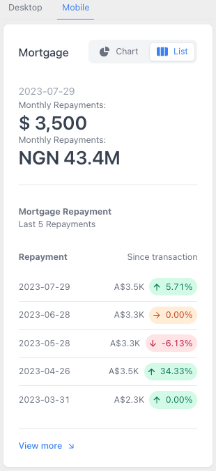
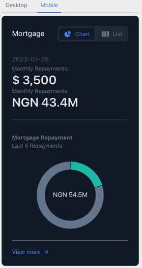
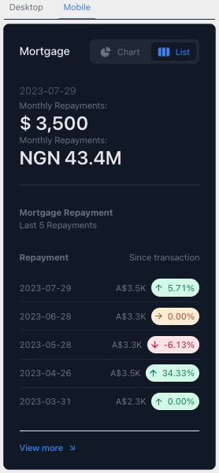

# Mortgage Repayment Dashboard
This is a simple mortgage repayment Dashboard that allows you to visualise the monthly repayment amount for a given loan amount, interest rate and loan term. This is developed with React and the api is built with FastAPI that service the data. To know about the backend, please visit [here](https://github.com/statsit/mortgage-app.git). 

## Demos

### Desktop View


### Desktop View


### Mobile View




### Mobile Night View





## Installation
Ensure you install nodejs and npm on your machine. To install nodejs and npm, please visit [here](https://nodejs.org/en/download/).
node version >=14.17.0 and npm version >=6.14.13 was used for this project.
    
## Run Locally
1. Clone the project

```bash
  git clone https://github.com/statsit/Mortgage-report-app
```

2. Go to the project directory

  ```bash
    cd Mortgage-report-app
  ```
  If nvm is installed, run the following command to install the node version used for this project

  ```bash
    nvm use
  ```
  3. Install the dependencies 
    
    ```bash
      npm install
    ```
4. Start the server. Ensure the backend is running before starting the frontend. Use port 8000 for the backend and port 3000 for the frontend. For backend, check [here](https://github.com/statsit/mortgage-app.git).
  
  ```bash
    npm start
  ```

# Hi, I'm Ade! 👋


## 🚀 About Me
I'm a full stack AI developer...


## Authors

- [@aakinlalu](https://www.github.com/aakinlalu)


## 🛠 Skills
AI, ML, DE,  Python, Javascript, ReactJS, HTML, CSS...


## 🔗 Links
[](https://codestreet.ai/)
[](https://www.linkedin.com/in/adebayo-akinlalu-5451a129/)
[](https://twitter.com/Akinlalu)


 


